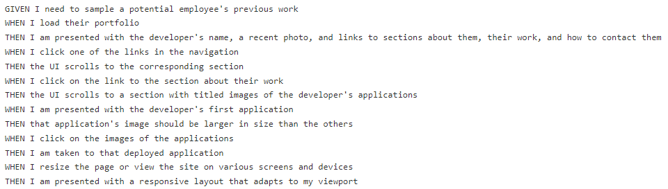

# Portfolio-1

## **Description**

The purpose of this homework was to create a portfolio of my coding projects. The site includes an "About Me" section where the visitor will find a picture of myself as well as a small blurb describing my professional journey up until the creation of this portfolio. The site also includes a "Contact Me" section as well as a navigation bar at the top of the site that includes a link my most updated resume. 

## **Acceptance Criteria**

See below:



## **Languages Used**

The programming languages used in this homework were html and css. 

## **Important Code Snippets**

The responsive flexbox grid layout was an important aspect to this portfolio. 

The below code set up the framework of the gridlayout that was created for the "My projects" section of the site. Above a screen size of 768px, the visitor will find 5 images that act as hyperlinks to some of my projects. The grid was comprised of 3 columns. The first column had 1 row and the next 2 columns had 2 rows each in order to create this even grid layout. 

```html
<section id="work">
    <h2>My Projects</h2>
    <div id="images">
        <div class="pictures" id="more1">
            <a class="imgcontainer" href="https://luccaloopz.github.io/mini-project-2/"><p class="imgtitle1">CSS Cheat Sheet</p></a>
        </div>
        <div class="pictures">
            <a class="imgcontainer" href="https://luccaloopz.github.io/01-Mini-Project-Landing-Page/"><p class="imgtitle2">Landing Page</p></a>
            <a class="imgcontainer" href="#"><p class="imgtitle3">placeholder</p></a>
        </div>
        <div class="pictures">
            <a class="imgcontainer" href="#"><p class="imgtitle4">placeholder</p></a>
            <a class="imgcontainer" href="#"><p class="imgtitle5">placeholder</p></a>
        </div>
    </div>
</section>
```

Below is the css to re-arange the layout of the grid for users with screen-sizes of 768px or less. Something to make note of is the fact that the flex direction of the grid (as seen by the `images` id) was switched to column in an effort to stack each hyperlinked image on top of one another for users at this screen-size. Finally, I added some left, right, and bottom margins to make sure that this section didn't interfere with the other two main sections of the site that it was sandwiched in-between. 

```css
    @media screen and (max-width: 768px) {

    #images {
        display: flex;
        justify-content: space-between;
        flex-direction: column;
        margin-bottom: 200px;
        margin-left: 10%;
        margin-right: 10%;
    }
}
```